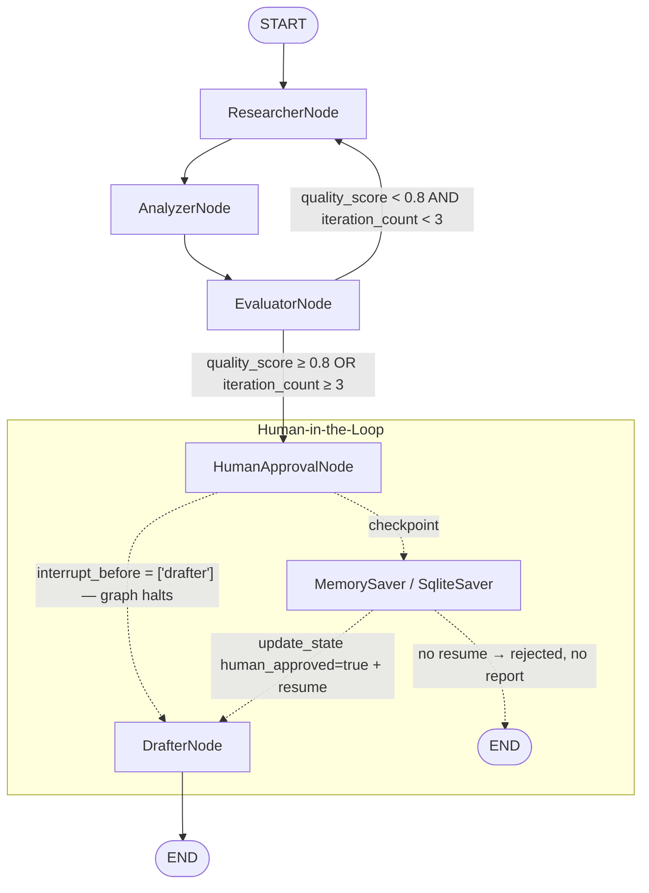

# Enterprise Multi-Agent Market Intelligence System (LangGraph)

An autonomous **market intelligence & competitor analysis pipeline**. Give it a
competitor name or industry keyword and it searches the live web, synthesizes
the findings into a strict typed schema, scores its own research quality in a
self-correction loop, pauses for **Human-in-the-Loop (HITL) approval**, and
emits a structured B2B outreach + intelligence report.

Built on **LangGraph 1.x**, **Pydantic v2**, and modern LangChain structured
outputs.

---

## System Architecture

The graph is a five-agent state machine with a conditional self-correction
loop and a checkpointed HITL interrupt:



| # | Node | Responsibility |
|---|------|----------------|
| 1 | `ResearcherNode` | Queries Tavily / Serper (or a deterministic mock) for pricing, audience, value propositions, strengths/weaknesses, and news. Re-queries the exact gaps named in `feedback`. |
| 2 | `AnalyzerNode` | Synthesizes raw search text into a strict `CompetitorMetrics` schema via `with_structured_output()`. Falls back to a rule-based extractor offline. |
| 3 | `EvaluatorNode` | Scores research quality `[0.0, 1.0]`. Below `QUALITY_THRESHOLD` (default `0.8`) with retry budget remaining, writes targeted `feedback` and routes back to `ResearcherNode`. |
| 4 | `HumanApprovalNode` | Validation gate immediately before the HITL checkpoint. |
| 5 | `DrafterNode` | Generates the B2B intelligence report + cold outreach email (`OutreachDraft`) from approved research. |

## Feature Highlights

- **State Persistence** — every thread is checkpointed with `MemorySaver`;
  runs can be interrupted, inspected, and resumed at any time.
- **Self-Correction Routing** — the evaluator drives the researcher back out
  (up to `MAX_RESEARCH_ITERATIONS` loops) until the quality score clears the
  threshold or the budget is spent.
- **Pydantic Type Safety** — all payloads flow through strict Pydantic v2
  models (`CompetitorMetrics`, `ResearchReport`, `OutreachDraft`); the
  analyzer uses `with_structured_output()` to force schema compliance.
- **Human-in-the-Loop Checkpointing** — `interrupt_before=["drafter"]` halts
  the graph before any report is generated; an operator reviews the evidence,
  then approves/rejects via state update + resume.
- **Zero-Key First Run** — with no API keys configured, the pipeline runs on
  mock search + template drafting so you can test the whole flow immediately.

## Repository Layout

```
agentic-market-intelligence-langgraph/
├── state.py        # Pydantic models + AgentState (TypedDict)
├── search.py       # Tavily / Serper / mock search factory
├── nodes.py        # Researcher, Analyzer, Evaluator, HumanApproval, Drafter
├── graph.py        # StateGraph topology, routing, MemorySaver + interrupt_before
├── config.py       # .env loading, LLM factory, pipeline tuning knobs
├── main.py         # CLI: run / resume / inspect
├── outputs/        # Written final JSON reports (gitignored)
├── .env.example    # Env template
└── requirements.txt
```

## Quickstart

### 1. Set up

```powershell
cd agentic-market-intelligence-langgraph
python -m venv venv
.\venv\Scripts\Activate.ps1
pip install -r requirements.txt
```

### 2. Configure credentials (optional but recommended)

```powershell
Copy-Item .env.example .env   # then edit .env
```

At a minimum set one LLM provider key (`GOOGLE_API_KEY`, `OPENAI_API_KEY`, or
`ANTHROPIC_API_KEY`) and one search key (`TAVILY_API_KEY` or `SERPER_API_KEY`).
With no keys set, the pipeline runs in mock mode automatically.

> To use Google Gemini: `pip install langchain-google-genai`. See
> `requirements.txt` for the other provider packages.

### 3. Run the pipeline

```powershell
# Full interactive run (pauses for HITL approval before drafting)
python main.py run "Salesforce"

# Offline demo — no API keys required
python main.py run "Salesforce" --offline --auto-approve

# Run with an explicit provider override
python main.py run "Notion" --llm-model openai:gpt-4o

# Print the final report as raw JSON
python main.py run "Salesforce" --auto-approve --json
```

You'll see each node execute (`researcher -> analyzer -> evaluator ->`), the
evaluator's quality score, and — if the score is below `0.8` — an automatic
loop back to research. The run then **interrupts** before `drafter`:

```text
[run] interrupted before node(s): ['drafter']
==========================================================
  HUMAN-IN-THE-LOOP REVIEW
==========================================================
  Target company : Salesforce
  Quality score  : 0.950
  Retry loops    : 0
  Source records : 4
  Pricing        : Enterprise starts at ~$165/user/month...
  Target audience: Large B2B organizations...
  Value props    : CRM leader, AI-powered...
==========================================================
Approve research and draft the report? [y/N]:
```

### 4. HITL: inspect, resume, reject

The interrupt is a **checkpoint**, not a dead-end — the thread is fully
resumable:

```powershell
# Inspect a thread's state (does not mutate it)
python main.py inspect --thread-id mi-abc123

# Approve and resume an interrupted run
python main.py resume --thread-id mi-abc123 --approve

# Reject (thread preserved; no report drafted)
python main.py resume --thread-id mi-abc123 --reject
```

The final report is written to `outputs/<thread-id>.json` and printed to
stdout. It contains the structured `research_report` (including `metrics`,
`research_queries`, `quality_score`) plus the `outreach_draft`
(`intelligence_summary`, `cold_outreach_email`, `recommended_follow_ups`).

> **Persistence:** the graph compiles with `MemorySaver` by default (as
> specified). The CLI swaps that for a `SqliteSaver` on `checkpoints.db` so
> `inspect` / `resume` work across separate processes. For a programmatic
> single-process run, `MemorySaver` is fine — threads live for the lifetime of
> the process.

## How the Self-Correction Loop Works

1. `EvaluatorNode` weights each dimension (pricing & audience are heaviest).
2. If `quality_score < 0.8` **and** `iteration_count < 3`, the conditional
   edge routes back to `ResearcherNode` with `feedback` that names exactly
   what is missing (e.g. *"pricing: Re-run targeted pricing queries..."*).
3. `ResearcherNode` translates that feedback into targeted search queries;
   results **accumulate** in `raw_search_data` (an `operator.add` channel) so
   nothing from earlier rounds is lost.
4. The loop exits when the score clears the threshold or the retry budget is
   exhausted — whichever comes first.

## Programmatic API

```python
from config import get_llm, has_llm_config
from graph import build_graph

llm = get_llm() if has_llm_config() else None
graph = build_graph(llm=llm)

config = {"configurable": {"thread_id": "mi-prod-001"}}
graph.invoke({"target_company": "Slack"}, config)        # halts before drafter

snapshot = graph.get_state(config)                        # inspect evidence
graph.update_state(config, {"human_approved": True})      # approve
graph.invoke(None, config)                                # resume -> report

result = graph.get_state(config).values
print(result["final_report"])                             # structured JSON
```

## Tuning Knobs (`.env`)

| Variable | Default | Purpose |
|----------|---------|---------|
| `LLM_MODEL` | `google_genai:gemini-2.5-flash` | `<provider>:<model>` for analyzer + drafter |
| `TAVILY_API_KEY` / `SERPER_API_KEY` | — | Live search backends (falls back to mock) |
| `QUALITY_THRESHOLD` | `0.8` | Evaluator pass/fail bar |
| `MAX_RESEARCH_ITERATIONS` | `3` | Max self-correction loops |
| `SEARCH_RESULTS_PER_QUERY` | `5` | Results fetched per query |

## Extending the Pipeline

- **New agents** — add a callable class in `nodes.py`, register it with
  `builder.add_node(...)` in `graph.py`, and wire edges.
- **New evidence sources** — implement any `(query) -> list[dict]` callable
  and pass it to `build_graph(search_tool=...)`; the researcher is agnostic.
- **Persistence upgrades** — swap `MemorySaver()` for `SqliteSaver` /
  `PostgresSaver` in `graph.py` to survive process restarts.
- **Stricter schema** — add fields to `CompetitorMetrics`; the analyzer's
  `with_structured_output` and the evaluator's weights update automatically.

## Notes on the Legacy Codebase

This project supersedes the original `backend/` + `frontend/` story generator
in this repository. The legacy files are left untouched for reference; all new
work lives in `agentic-market-intelligence-langgraph/`.
